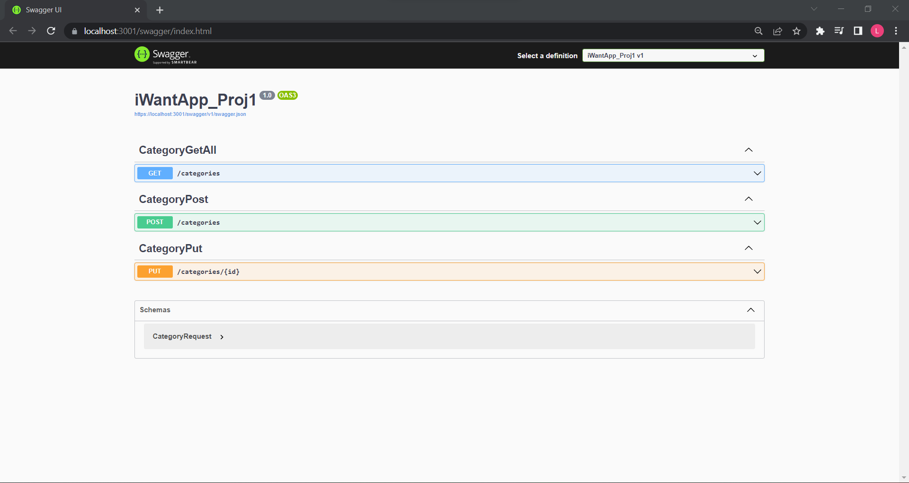

<h1>iWantApp_1 V1.0</h1>

Projeto em C# do curso .NET 6 WEB API - Do zero ao avançado

O processo será dividido por `branchs`.

No momento montamos a seguinte etapa:

1. Primeiros passos :white_check_mark:

<h3>Sobre esta versão:</h3>

Foi criado um <b>REST-API</b>  para a entidade `Category`. 

 

Acessando `https://localhost:3001/swagger/index.html` o usuário pode incluir, atualizar e mostrar dados da entidade <b>Category</b>. 

<h3>Technologias utilizadas</h3>

* .NET Core 6
* Docker / Sql Server Image
* Visual Studios 2022

